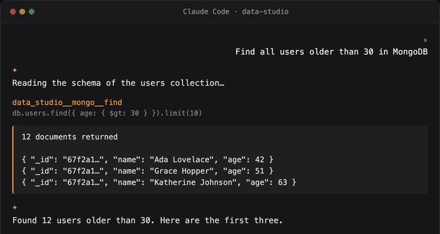

<div align="center">


# Data Studio Agent

**Let your AI coding agent securely access all your databases, in plain language.**

**Local-first. Enterprise-grade security. Open source.**

[](https://github.com/geek-fun/data-studio-agent/releases)
[](https://github.com/geek-fun/data-studio-agent/releases)
[](https://www.npmjs.com/package/@geek-fun/data-studio-mcp)
[](LICENSE)
[](https://github.com/geek-fun/data-studio-agent/stargazers)
[](https://github.com/geek-fun/data-studio-agent/actions/workflows/ci.yml)

<p>
  
  
  
  
</p>

<p align="center">
  
</p>

[📖 Product Page](https://www.geekfun.club/products/data-studio-agent/) · [npm](https://www.npmjs.com/package/@geek-fun/data-studio-mcp) · [dockit](https://github.com/geek-fun/dockit) · [sqlkit](https://github.com/geek-fun/sqlkit) · [Releases](https://github.com/geek-fun/data-studio-agent/releases)

English · [简体中文](README_zh.md)

</div>

---

This repository contains the **Data Studio MCP Server**, a [Model Context Protocol](https://modelcontextprotocol.io/) server that gives AI coding agents direct access to your databases through the [dockit](https://github.com/geek-fun/dockit) and [sqlkit](https://github.com/geek-fun/sqlkit) desktop apps.

- **SQL** (via sqlkit): **70+ databases** (PostgreSQL, MySQL, SQL Server, Oracle, SQLite, DuckDB, ClickHouse, Snowflake, BigQuery, and more)
- **NoSQL** (via dockit): Elasticsearch, OpenSearch, MongoDB, DynamoDB

## Features

- **Any AI coding agent.** Claude Code, Cursor, Windsurf, OpenCode, Codex, Cline, Pi, Qoder, GitHub Copilot, or any MCP client.
- **Any OS.** macOS, Windows, Linux.
- **Any LLM model.** Bring your own provider. No lock-in.
- **One MCP server, one config.** Routes to both SqlKit (SQL) and DocKit (NoSQL) bridges over localhost.
- **Enterprise-grade security.** See below.

## Quick start

### 1. Prerequisites

Install and launch [dockit](https://github.com/geek-fun/dockit) and/or [sqlkit](https://github.com/geek-fun/sqlkit), add a database connection, and make sure **Settings → MCP Bridge → Auto-start** is enabled (it is by default). Install both apps for the full SQL + NoSQL tool set.

### 2. Install the MCP server

```bash
npm install -g @geek-fun/data-studio-mcp
```

Or run it without installing (npx downloads it on first run):

```bash
npx -y @geek-fun/data-studio-mcp
```

### 3. Add it to your AI tool

**OpenAI Codex**, one command:

```bash
codex mcp add data-studio -- npx -y @geek-fun/data-studio-mcp
```

**Claude Code**, one command:

```bash
claude mcp add --transport stdio data-studio -- npx -y @geek-fun/data-studio-mcp
```

**Cursor.** Create `.cursor/mcp.json` (project) or `~/.cursor/mcp.json` (global):

```json
{
  "mcpServers": {
    "data-studio": {
      "command": "npx",
      "args": ["-y", "@geek-fun/data-studio-mcp"]
    }
  }
}
```

**Windsurf.** Create `~/.codeium/windsurf/mcp_config.json` (global only):

```json
{
  "mcpServers": {
    "data-studio": {
      "command": "npx",
      "args": ["-y", "@geek-fun/data-studio-mcp"]
    }
  }
}
```

**OpenCode.** Add to `opencode.json` (project) or `~/.config/opencode/opencode.json` (global):

```json
{
  "$schema": "https://opencode.ai/config.json",
  "mcp": {
    "data-studio": {
      "type": "local",
      "command": ["npx", "-y", "@geek-fun/data-studio-mcp"],
      "enabled": true
    }
  }
}
```

**Any other MCP client.** Register a stdio server with command `npx` and args `-y @geek-fun/data-studio-mcp`.

### 4. Tune permissions (optional)

Open **Settings → MCP Bridge** in dockit/sqlkit to control what the agent can do:

| Permission mode | What the agent can do |
|---|---|
| **Read Only** (default) | Explore schemas, run SELECT queries. No writes. |
| **Data Read/Write** | INSERT, UPDATE, index operations. No deletes/drops. |
| **Full Access** | Everything, including DELETE, DROP, TRUNCATE. |

### 5. Start asking

Use plain language. The agent queries your databases for you:

- "List all tables in my PostgreSQL database"
- "Show me the last 10 orders from the Elasticsearch index `orders*`"
- "Find all users older than 30 in MongoDB"
- "Run this query and explain the results"

The agent reads schemas, runs queries, and explores your data, then shows you every query it executed.

## Enterprise-grade security

The LLM gets broad access to your data, but it never sees your credentials. The policy model gates every capability by risk level.

- **Credentials never leave the apps.** The LLM only ever sees an opaque `connection_id`. Real credentials are resolved inside dockit/sqlkit and never cross the MCP boundary. Your passwords and keys stay on your machine, in your app.
- **ID-based resource access.** Agents access databases strictly by connection ID. Credentials never appear in prompts or tool arguments, so there is no path for the model to obtain or exfiltrate connection secrets.
- **Three-tier permission model.** Read Only / Data Read-Write / Full Access modes gate every capability by risk level, with per-connection overrides. You can mark any connection read-only or allowlist specific actions.
- **Explicit user confirmation.** Destructive operations (DELETE, DROP, TRUNCATE) surface as `Ask` in the policy. The client prompts the user for explicit confirmation before anything destructive runs.
- **Action-level statement classification.** SQL is parsed and classified by statement kind (Read / Write / Delete / DDL) before execution. Write-only tools reject DELETE statements; delete tools reject DDL.
- **Local-only bridge.** The bridge binds to `127.0.0.1` exclusively. It is unreachable from other machines, with no server to host and no API keys to manage.

## Tool reference

All tools follow the `data_studio__{backend}__{action}` convention. The **User confirmation** column shows which operations surface an explicit confirmation prompt in your AI client before they run.

| Tool | Backend | Risk | Requires permission | User confirmation |
|---|---|---|---|---|
| `data_studio__list_connections` | Server | 🟢 Safe | Read Only | No |
| `data_studio__get_status` | Server | 🟢 Safe | Read Only | No |
| `data_studio__sqlkit__list_connections` | sqlkit | 🟢 Safe | Read Only | No |
| `data_studio__sqlkit__execute_query` | sqlkit | 🟢 Safe | Read Only | No |
| `data_studio__sqlkit__list_databases` | sqlkit | 🟢 Safe | Read Only | No |
| `data_studio__sqlkit__list_schemas` | sqlkit | 🟢 Safe | Read Only | No |
| `data_studio__sqlkit__list_tables` | sqlkit | 🟢 Safe | Read Only | No |
| `data_studio__sqlkit__get_schema` | sqlkit | 🟢 Safe | Read Only | No |
| `data_studio__sqlkit__describe_table` | sqlkit | 🟢 Safe | Read Only | No |
| `data_studio__sqlkit__explain_query` | sqlkit | 🟢 Safe | Read Only | No |
| `data_studio__sqlkit__execute_write` | sqlkit | 🟡 Elevated | Data Read-Write | No |
| `data_studio__sqlkit__execute_delete` | sqlkit | 🔴 Destructive | Full Access | Yes |
| `data_studio__sqlkit__execute_ddl` | sqlkit | 🔴 Destructive | Full Access | Yes |
| `data_studio__es__search` | dockit · Elasticsearch | 🟢 Safe | Read Only | No |
| `data_studio__es__get_document` | dockit · Elasticsearch | 🟢 Safe | Read Only | No |
| `data_studio__es__cat_indices` | dockit · Elasticsearch | 🟢 Safe | Read Only | No |
| `data_studio__es__get_mapping` | dockit · Elasticsearch | 🟢 Safe | Read Only | No |
| `data_studio__es__cat_aliases` | dockit · Elasticsearch | 🟢 Safe | Read Only | No |
| `data_studio__es__get_alias` | dockit · Elasticsearch | 🟢 Safe | Read Only | No |
| `data_studio__es__index_document` | dockit · Elasticsearch | 🟡 Elevated | Data Read-Write | No |
| `data_studio__es__update_document` | dockit · Elasticsearch | 🟡 Elevated | Data Read-Write | No |
| `data_studio__es__create_index` | dockit · Elasticsearch | 🟡 Elevated | Data Read-Write | No |
| `data_studio__es__put_mapping` | dockit · Elasticsearch | 🟡 Elevated | Data Read-Write | No |
| `data_studio__es__put_alias` | dockit · Elasticsearch | 🟡 Elevated | Data Read-Write | No |
| `data_studio__es__update_aliases` | dockit · Elasticsearch | 🟡 Elevated | Data Read-Write | No |
| `data_studio__es__delete_document` | dockit · Elasticsearch | 🔴 Destructive | Full Access | Yes |
| `data_studio__es__delete_by_query` | dockit · Elasticsearch | 🔴 Destructive | Full Access | Yes |
| `data_studio__es__delete_index` | dockit · Elasticsearch | 🔴 Destructive | Full Access | Yes |
| `data_studio__es__delete_alias` | dockit · Elasticsearch | 🔴 Destructive | Full Access | Yes |
| `data_studio__mongo__list_databases` | dockit · MongoDB | 🟢 Safe | Read Only | No |
| `data_studio__mongo__list_collections` | dockit · MongoDB | 🟢 Safe | Read Only | No |
| `data_studio__mongo__find` | dockit · MongoDB | 🟢 Safe | Read Only | No |
| `data_studio__mongo__collection_stats` | dockit · MongoDB | 🟢 Safe | Read Only | No |
| `data_studio__mongo__database_stats` | dockit · MongoDB | 🟢 Safe | Read Only | No |
| `data_studio__mongo__server_status` | dockit · MongoDB | 🟢 Safe | Read Only | No |
| `data_studio__mongo__repl_set_status` | dockit · MongoDB | 🟢 Safe | Read Only | No |
| `data_studio__mongo__shard_status` | dockit · MongoDB | 🟢 Safe | Read Only | No |
| `data_studio__mongo__count_documents` | dockit · MongoDB | 🟢 Safe | Read Only | No |
| `data_studio__mongo__list_indexes` | dockit · MongoDB | 🟢 Safe | Read Only | No |
| `data_studio__mongo__sample_documents` | dockit · MongoDB | 🟢 Safe | Read Only | No |
| `data_studio__mongo__aggregate` | dockit · MongoDB | 🟡 Elevated | Data Read-Write | No |
| `data_studio__mongo__insert_one` | dockit · MongoDB | 🟡 Elevated | Data Read-Write | No |
| `data_studio__mongo__update_many` | dockit · MongoDB | 🟡 Elevated | Data Read-Write | No |
| `data_studio__mongo__update_document` | dockit · MongoDB | 🟡 Elevated | Data Read-Write | No |
| `data_studio__mongo__create_database` | dockit · MongoDB | 🟡 Elevated | Data Read-Write | No |
| `data_studio__mongo__create_collection` | dockit · MongoDB | 🟡 Elevated | Data Read-Write | No |
| `data_studio__mongo__rename_collection` | dockit · MongoDB | 🟡 Elevated | Data Read-Write | No |
| `data_studio__mongo__clone_collection` | dockit · MongoDB | 🟡 Elevated | Data Read-Write | No |
| `data_studio__mongo__create_index` | dockit · MongoDB | 🟡 Elevated | Data Read-Write | No |
| `data_studio__mongo__drop_index` | dockit · MongoDB | 🟡 Elevated | Data Read-Write | No |
| `data_studio__mongo__delete_many` | dockit · MongoDB | 🔴 Destructive | Full Access | Yes |
| `data_studio__mongo__delete_document` | dockit · MongoDB | 🔴 Destructive | Full Access | Yes |
| `data_studio__mongo__drop_collection` | dockit · MongoDB | 🔴 Destructive | Full Access | Yes |
| `data_studio__mongo__drop_database` | dockit · MongoDB | 🔴 Destructive | Full Access | Yes |
| `data_studio__mongo__truncate_collection` | dockit · MongoDB | 🔴 Destructive | Full Access | Yes |
| `data_studio__dynamo__execute_query` | dockit · DynamoDB | 🟢 Safe | Read Only | No |
| `data_studio__dynamo__describe_table` | dockit · DynamoDB | 🟢 Safe | Read Only | No |
| `data_studio__dynamo__list_tables` | dockit · DynamoDB | 🟢 Safe | Read Only | No |
| `data_studio__dynamo__query_table` | dockit · DynamoDB | 🟢 Safe | Read Only | No |
| `data_studio__dynamo__scan_table` | dockit · DynamoDB | 🟢 Safe | Read Only | No |
| `data_studio__dynamo__describe_continuous_backups` | dockit · DynamoDB | 🟢 Safe | Read Only | No |
| `data_studio__dynamo__describe_ttl` | dockit · DynamoDB | 🟢 Safe | Read Only | No |
| `data_studio__dynamo__get_table_metrics` | dockit · DynamoDB | 🟢 Safe | Read Only | No |
| `data_studio__dynamo__execute_write` | dockit · DynamoDB | 🟡 Elevated | Data Read-Write | No |
| `data_studio__dynamo__create_item` | dockit · DynamoDB | 🟡 Elevated | Data Read-Write | No |
| `data_studio__dynamo__batch_write_items` | dockit · DynamoDB | 🟡 Elevated | Data Read-Write | No |
| `data_studio__dynamo__update_item` | dockit · DynamoDB | 🟡 Elevated | Data Read-Write | No |
| `data_studio__dynamo__create_gsi` | dockit · DynamoDB | 🟡 Elevated | Data Read-Write | No |
| `data_studio__dynamo__update_gsi` | dockit · DynamoDB | 🟡 Elevated | Data Read-Write | No |
| `data_studio__dynamo__create_table` | dockit · DynamoDB | 🟡 Elevated | Data Read-Write | No |
| `data_studio__dynamo__update_table_config` | dockit · DynamoDB | 🟡 Elevated | Data Read-Write | No |
| `data_studio__dynamo__update_ttl` | dockit · DynamoDB | 🟡 Elevated | Data Read-Write | No |
| `data_studio__dynamo__update_pitr` | dockit · DynamoDB | 🟡 Elevated | Data Read-Write | No |
| `data_studio__dynamo__update_streams` | dockit · DynamoDB | 🟡 Elevated | Data Read-Write | No |
| `data_studio__dynamo__execute_delete` | dockit · DynamoDB | 🔴 Destructive | Full Access | Yes |
| `data_studio__dynamo__delete_item` | dockit · DynamoDB | 🔴 Destructive | Full Access | Yes |
| `data_studio__dynamo__delete_gsi` | dockit · DynamoDB | 🔴 Destructive | Full Access | Yes |
| `data_studio__dynamo__delete_table` | dockit · DynamoDB | 🔴 Destructive | Full Access | Yes |
| `data_studio__dynamo__truncate_table` | dockit · DynamoDB | 🔴 Destructive | Full Access | Yes |

**79 tools total.** Read-only operations run automatically under **Read Only** mode. Elevated operations (writes, index/schema changes) require **Data Read-Write**. Destructive operations (DELETE, DROP, TRUNCATE) require **Full Access** and always surface an explicit **user confirmation** prompt.

## How it works

```
code agent (Claude Code / Cursor / OpenCode ...)
    |
    | MCP stdio protocol
    v
@geek-fun/data-studio-mcp   ← npm package (pure TypeScript)
    |
    | HTTP (localhost)
    +----------------+----------------+
    v                v                |
dockit:9120    sqlkit:9121            |
(NoSQL bridge)  (SQL bridge)          |
    |                |                |
    v                v                |
Elasticsearch    PostgreSQL           |
MongoDB          MySQL                |
DynamoDB         SQL Server           |
OpenSearch       SQLite               |
```

The MCP server is a thin routing layer. All database drivers, SSH tunnels, and connection management live in the desktop apps, which expose a local HTTP bridge (`127.0.0.1` only). The MCP server auto-discovers running backends via each app's port file.

---

## For developers

This repository also contains the **data-studio-agent Rust framework**, the shared AI agent loop (provider adapters, streaming, tool calling, context compaction) that powers the built-in assistants in [dockit](https://github.com/geek-fun/dockit) and [sqlkit](https://github.com/geek-fun/sqlkit).

See [crates/data-studio-agent/README.md](crates/data-studio-agent/README.md) for installation, architecture, and integration guides.

## License

Apache 2.0. See [LICENSE](LICENSE).
